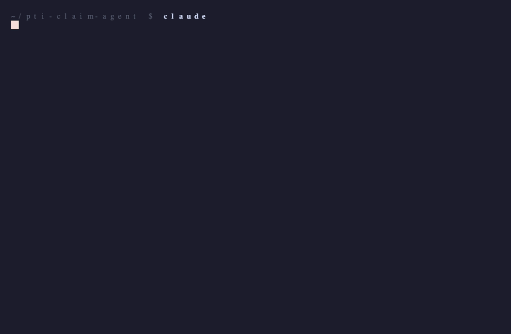

# PTI Claim Agent

An [Antigravity](https://github.com/google-deepmind) template for filing PTI (Bưu Điện) health insurance claims by chatting with an AI agent.



> **What it does**: drop your medical receipts in chat → the agent reads them, extracts insured / hospital / date / amount, fills the official PTI claim form, embeds your signature, and creates a Gmail draft ready to send. ~2 minutes per claim instead of ~20.

Built originally for the **NABVN Healthcare Program (VSDC)**, but the pattern works for any group health policy that uses the same Marsh/PTI claim flow.

---

## How it works

You file maybe 1–5 claims a year. Each time, the steps are the same: fill a Word form, embed a signature, write a polite email, attach 3–6 receipts, send. This template turns those steps into one conversation:

```
You: file a claim for [name]
     [drop receipt PDFs / photos into chat]

Agent: Insured: ...
       Hospital: ...
       Date: ...
       Total: ... VND
       Confirm? (y/n)

You: y

Agent: ✅ Draft created in Gmail. Subject: HS YCBT - ...
       Review and send.
```

---

## Two integration paths

The only meaningful setup choice is **how the Gmail draft gets attachments**. Pick one — your local ANTIGRAVITY.md will be tailored to that path.

### Path A — Manual attach (zero setup)
- Uses the Gmail MCP connector connected to Antigravity.
- Agent creates a body-only draft and bundles all your files into one folder.
- You open Gmail, drag the bundled folder's contents into the draft, send.
- **Setup**: 0 minutes. **Per-claim friction**: ~30 sec of dragging.

### Path B — Auto attach (10 min setup)
- Uses your own [Google Cloud OAuth client](https://console.cloud.google.com/) + Python + Gmail API.
- Agent creates a fully-attached draft. You review and send.
- **Setup**: ~10 min in Google Cloud Console once. **Per-claim friction**: zero.

| | Path A | Path B |
|---|---|---|
| Setup time | 0 min | ~10 min |
| Per-claim friction | Drag files (~30 sec) | None |
| Security surface | Existing MCP grant | One OAuth token (scope `gmail.compose`) on local disk |
| Works without Antigravity infra | ❌ | ✅ |
| Multi-device | Wherever your MCP works | Wherever you copy the token |
| Recommended for | 1–5 claims/year | 6+ claims/year, multi-claim batches |

**Default recommendation**: Path A unless you're filing claims often.

---

## Getting started

### 1. Prereqs
- Antigravity installed.
- Gmail MCP connected in Antigravity — needed for both paths.
- Python 3.9+ — only needed for Path B.

### 2. Clone
```bash
git clone https://github.com/pkngoc/pti-claim-agent.git ~/pti-claim-agent
cd ~/pti-claim-agent
```

### 3. Drop in your assets
Put two files in `assets/`:
- `blank_form.docx` — the official PTI claim form (your HR / insurance broker has it; PTI also publishes it at https://pti.com.vn)
- `signature.png` — a transparent-background PNG of your signature, ~300–600px wide

### 4. Launch Antigravity in this folder
```bash
cd ~/pti-claim-agent
antigravity
```

On first launch, the agent reads [`ANTIGRAVITY.md`](./ANTIGRAVITY.md) and will:
1. Ask which path (A or B) you want.
2. Walk you through filling in your personal details (policy number, insureds, bank, signature, email routing).
3. If Path B: walk you through the Google Cloud Console flow.

After that, every claim is just **"file a claim for [name]" + drop evidence in chat**.

---

## What's tracked vs. ignored

`.gitignore` keeps these out of git:
- `credentials.json`, `token.json` — OAuth secrets
- `assets/blank_form.docx`, `assets/signature.png` — your personal docs
- `output/` — filled forms + per-claim bundles

Your personal details in `ANTIGRAVITY.md` (policy number, insureds, bank) **are** tracked by git in your local clone. Keep this repo private (or strip those before pushing) if you fork.

---

## Adapting to other insurers / use cases

The skeleton is generic: agentic extraction from receipts → fill a `.docx` template with `{{KEY}}` placeholders → embed a signature image → create a Gmail draft. To adapt:

1. Swap `assets/blank_form.docx` for the new form (tokens or labels).
2. Update ANTIGRAVITY.md: profile, insureds, email routing, body template.
3. The Python helper (`scripts/send_claim_oauth.py`) for Path B is form-agnostic.

Works for expense reimbursement, travel claims, warranty claims — anything that's "fill a form + email it with receipts attached".

---

## Re-rendering the demo GIF

Install [vhs](https://github.com/charmbracelet/vhs) and run:

```bash
brew install vhs ttyd chromium
vhs scripts/demo.tape   # writes demo.gif
```

The "session" is scripted in `scripts/demo.sh` — edit pacing or copy there.

## License

MIT — see [LICENSE](./LICENSE).

## Credits

Built collaboratively with Antigravity by [@pkngoc](https://github.com/pkngoc). PRs welcome.
